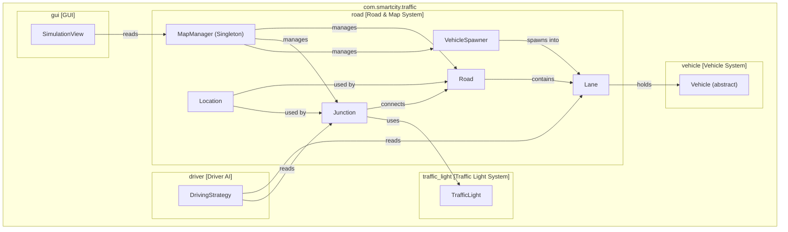
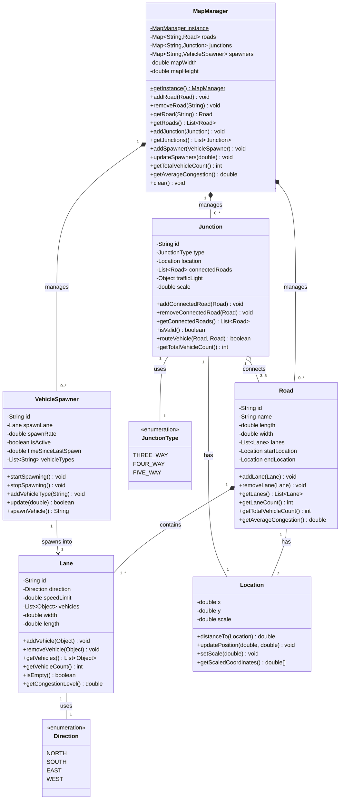

# 4. Road & Map System

> **Dự án:** Smart City Traffic Simulation | **Module:** Phần 4 – Road & Map System | **Thành viên:** Tiến Đạt

---

## Mục lục

1. [Bảng thống kê dữ liệu](#1-bảng-thống-kê-dữ-liệu)
2. [Biểu đồ phụ thuộc gói (Package Diagram)](#2-biểu-đồ-phụ-thuộc-gói)
3. [Biểu đồ lớp (Class Diagram)](#3-biểu-đồ-lớp)
4. [Giải thích thiết kế](#4-giải-thích-thiết-kế)
5. [Kỹ thuật OOP đã áp dụng](#5-kỹ-thuật-oop-đã-áp-dụng)
6. [Công nghệ sử dụng và thuật toán](#6-công-nghệ-sử-dụng-và-thuật-toán)
7. [Hướng dẫn sử dụng](#7-hướng-dẫn-sử-dụng)

---

## 1. Bảng thống kê dữ liệu

### 1.1 Thống kê cấu trúc module

| Thành phần | Số lượng | Mô tả |
|---|---|---|
| Lớp (Class) | 6 | MapManager, Road, Lane, Junction, VehicleSpawner, Location |
| Enum | 2 | Direction (4 giá trị), JunctionType (3 giá trị) |
| Package | 1 | `com.smartcity.traffic.road` |
| Phương thức (Method) | 45+ | Tổng số phương thức công khai trên tất cả các lớp |
| Thuộc tính (Field) | 30+ | Tổng số thuộc tính trên tất cả các lớp |
| Dòng code (LOC) | ~600 | Tổng số dòng code Java |

### 1.2 Thống kê các lớp

| Lớp | Thuộc tính | Phương thức | Vai trò | Pattern áp dụng |
|---|---|---|---|---|
| **MapManager** | 5 | 14 | Quản lý toàn bộ bản đồ | Singleton |
| **Road** | 6 | 8 | Đại diện con đường | Composition |
| **Lane** | 6 | 8 | Đại diện làn đường | Encapsulation |
| **Junction** | 6 | 8 | Quản lý ngã rẽ | Enum + Composition |
| **VehicleSpawner** | 6 | 9 | Sinh phương tiện tự động | Encapsulation |
| **Location** | 3 | 5 | Quản lý tọa độ & tỷ lệ hiển thị | Utility |

### 1.3 Thống kê loại ngã rẽ được hỗ trợ

| Loại ngã rẽ | Enum | Số đường kết nối | Ví dụ thực tế |
|---|---|---|---|
| Ngã ba | `THREE_WAY` | 3 | Ngã ba Hàng Bài – Đinh Tiên Hoàng |
| Ngã tư | `FOUR_WAY` | 4 | Ngã tư Lê Văn Lương – Hoàng Quốc Việt |
| Ngã năm | `FIVE_WAY` | 5 | Ngã năm Ô Chợ Dừa, Hà Nội |

### 1.4 Thống kê hướng di chuyển

| Hướng | Enum | Tác động tọa độ | Ví dụ |
|---|---|---|---|
| Bắc (North) | `NORTH` | Giảm y | Đi từ Hà Nội lên Thái Nguyên |
| Nam (South) | `SOUTH` | Tăng y | Đi từ Hà Nội xuống TP.HCM |
| Đông (East) | `EAST` | Tăng x | Đi từ Hà Nội ra biển Đông |
| Tây (West) | `WEST` | Giảm x | Đi từ Hà Nội sang Điện Biên |

### 1.5 Thống kê tỷ lệ hiển thị (Scale)

| Khu vực | Scale mặc định | Ý nghĩa |
|---|---|---|
| Đường thẳng (Road) | 1.0 | Hiển thị bình thường |
| Ngã rẽ (Junction) | 1.5 | Phóng to 1.5x để quan sát chi tiết |
| Mạng lưới rộng | 0.5 – 0.8 | Thu nhỏ để nhìn toàn cảnh |
| Giá trị tối thiểu | 0.1 | Giới hạn để đối tượng không biến mất |

---

## 2. Biểu đồ phụ thuộc gói

Biểu đồ dưới đây thể hiện mối quan hệ phụ thuộc giữa package **road** (Road & Map System) và các package khác trong hệ thống. Package **road** là trung tâm, được sử dụng bởi **gui** và **driver**, đồng thời phụ thuộc vào **vehicle** và **traffic_light**.



---

## 3. Biểu đồ lớp

Biểu đồ lớp thể hiện chi tiết cấu trúc nội bộ của tất cả 6 lớp trong Road & Map System, bao gồm thuộc tính, phương thức và mối quan hệ. Ký hiệu **♦** (composition) thể hiện quan hệ "chứa đựng", ký hiệu **→** thể hiện quan hệ "sử dụng".



---

## 4. Giải thích thiết kế

### 4.1 Package

**Package:** `com.smartcity.traffic.road`

Tên package tuân theo quy ước đặt tên Java (reverse domain name). Toàn bộ 6 lớp của Road & Map System được đặt trong cùng một package để thể hiện sự gắn kết về mặt chức năng.

| Package phụ thuộc | Lý do |
|---|---|
| `com.smartcity.traffic.vehicle` | Lane cần lưu trữ danh sách Vehicle |
| `com.smartcity.traffic.traffic_light` | Junction cần tham chiếu đến TrafficLight |
| `java.util` | Sử dụng ArrayList, LinkedHashMap, List |

### 4.2 Các lớp

#### MapManager — Trung tâm điều hành bản đồ

`MapManager` là lớp trung tâm của toàn bộ module, áp dụng mẫu Singleton để đảm bảo chỉ tồn tại một phiên bản duy nhất. Lớp này quản lý ba tập hợp chính: danh sách con đường (`roads`), danh sách ngã rẽ (`junctions`) và danh sách điểm sinh phương tiện (`spawners`), tất cả đều được lưu bằng `LinkedHashMap` để truy cập nhanh theo ID và duy trì thứ tự thêm vào.

> **Ví dụ thực tế:** MapManager giống như "Trung tâm Điều hành Giao thông Quốc gia" — chỉ có một trung tâm duy nhất, tất cả thông tin về đường phố, ngã rẽ, lưu lượng xe đều được quản lý tập trung tại đây.

#### Road — Con đường

Lớp `Road` đại diện cho một con đường cụ thể. Mỗi Road lưu trữ thông tin cơ bản (id, tên, chiều dài, chiều rộng) và chứa danh sách các Lane. Hai đối tượng Location (`startLocation`, `endLocation`) xác định vị trí bắt đầu và kết thúc trên bản đồ.

> **Ví dụ thực tế:** Đường Lê Văn Lương (Hà Nội) dài 3km, rộng 40m, có 4 làn xe — đây chính là một object Road với `length=3000`, `width=40`, `lanes=[L1, L2, L3, L4]`.

#### Lane — Làn đường

`Lane` là đơn vị nhỏ nhất của hạ tầng giao thông. Mỗi làn có một hướng di chuyển cố định (NORTH/SOUTH/EAST/WEST) và giới hạn tốc độ riêng. Lane duy trì danh sách các phương tiện đang lưu thông và tính toán mức độ tắc nghẽn dựa trên tỷ lệ số xe so với sức chứa tối đa.

> **Ví dụ thực tế:** Làn xe số 2 trên Đường Lê Văn Lương, chỉ cho phép đi về hướng Đông (EAST), giới hạn 60 km/h. Khi có 8/10 xe, mức tắc nghẽn = 80%.

#### Junction — Ngã rẽ

`Junction` quản lý các nút giao thông phức tạp. Enum `JunctionType` cho phép phân loại rõ ràng ngã ba, ngã tư, ngã năm. Phương thức `isValid()` kiểm tra tính hợp lệ: ngã tư phải có đúng 4 con đường kết nối. Thuộc tính `scale` mặc định là 1.5 để phóng to khu vực ngã rẽ khi hiển thị.

> **Ví dụ thực tế:** Ngã năm Ô Chợ Dừa (Hà Nội) là một `FIVE_WAY` Junction với 5 con đường kết nối, có đèn giao thông và được phóng to khi người dùng zoom vào để quan sát chi tiết.

#### VehicleSpawner — Điểm sinh phương tiện

`VehicleSpawner` mô phỏng các điểm đầu vào của mạng lưới giao thông. Cơ chế sinh dựa trên `deltaTime`: nếu thời gian tích lũy kể từ lần sinh cuối vượt ngưỡng `1/spawnRate`, một phương tiện mới được tạo ra.

> **Ví dụ thực tế:** Cổng vào Hà Nội từ đường cao tốc Pháp Vân – Cầu Giẽ: cứ 30 giây có khoảng 1 xe vào thành phố (`spawnRate ≈ 0.033 xe/giây`). Tỷ lệ: 60% ô tô, 30% xe tải, 10% xe khách.

#### Location — Tọa độ và tỷ lệ

`Location` là lớp tiện ích quản lý hệ tọa độ 2D và tỷ lệ hiển thị. Phương thức `distanceTo()` sử dụng công thức Euclidean để tính khoảng cách giữa hai điểm. Thuộc tính `scale` được GUI sử dụng để quyết định kích thước hiển thị của phương tiện tại từng khu vực.

---

## 5. Kỹ thuật OOP đã áp dụng

| Kỹ thuật | Áp dụng ở đâu | Lợi ích cụ thể |
|---|---|---|
| **Encapsulation** | Tất cả 6 lớp: thuộc tính `private`, truy cập qua getter/setter | Bảo vệ dữ liệu, kiểm soát giá trị hợp lệ (speedLimit không âm, scale ≥ 0.1) |
| **Composition** | MapManager chứa Road; Road chứa Lane; Junction chứa Road | Phản ánh đúng cấu trúc thực tế, dễ quản lý vòng đời đối tượng |
| **Singleton Pattern** | Lớp MapManager — phương thức `getInstance()` | Đảm bảo chỉ có 1 bản đồ duy nhất, tránh xung đột dữ liệu giữa các module |
| **Enum** | `Direction` (4 giá trị), `JunctionType` (3 giá trị) | Tránh lỗi chính tả, compiler kiểm tra giá trị hợp lệ, code dễ đọc |
| **Open/Closed Principle** | Thêm loại ngã rẽ mới chỉ cần thêm vào Enum, không sửa code cũ | Mở rộng dễ dàng, không phá vỡ code hiện tại |

### 5.1 Encapsulation — Chi tiết

Mọi thuộc tính trong các lớp đều được khai báo `private`. Ví dụ trong lớp Lane, thuộc tính `speedLimit` chỉ có thể được thay đổi qua `setSpeedLimit()`, phương thức này kiểm tra giá trị không âm trước khi gán.

```java
// Không thể làm điều này (compile error):
lane.speedLimit = -50;

// Phải đi qua setter — an toàn hơn:
lane.setSpeedLimit(-50);
// Bên trong: this.speedLimit = Math.max(0, speedLimit);
```

> **Ví dụ thực tế:** Khi bạn sử dụng ATM, bạn không thể trực tiếp truy cập vào tài khoản ngân hàng. Bạn phải thông qua các phương thức được cung cấp (rút tiền, gửi tiền, xem số dư). Ngân hàng kiểm tra xem bạn có đủ tiền không trước khi cho phép rút. Đó chính là Encapsulation.

### 5.2 Composition — Chi tiết

Quan hệ Composition (has-a) được thể hiện qua cấu trúc: một MapManager "có" nhiều Road, một Road "có" nhiều Lane. Khi một Road bị xóa khỏi MapManager, tất cả các Lane thuộc Road đó cũng không còn được tham chiếu và sẽ được garbage collector thu hồi bộ nhớ.

> **Ví dụ thực tế:** Một chiếc ô tô được tạo thành từ động cơ, bánh xe, ghế ngồi, vô lăng. Mỗi thành phần có thể được thay thế độc lập. Đó là Composition.

### 5.3 Singleton Pattern — Chi tiết

MapManager sử dụng lazy initialization với từ khóa `synchronized` để đảm bảo thread-safety trong môi trường đa luồng.

```java
public static synchronized MapManager getInstance() {
    if (instance == null) {
        instance = new MapManager(); // Chỉ tạo 1 lần duy nhất
    }
    return instance;
}
```

> **Ví dụ thực tế:** Trong một thành phố, chỉ có một "Trung tâm Điều hành Giao thông". Tất cả các phương tiện, đèn giao thông, camera giám sát đều báo cáo về trung tâm này. Không thể có 2 trung tâm điều hành khác nhau.

### 5.4 Enum — Chi tiết

Thay vì sử dụng các hằng số số nguyên (0=NORTH, 1=SOUTH...) dễ gây nhầm lẫn, hệ thống sử dụng Enum. Compiler Java sẽ báo lỗi ngay nếu bạn cố gắng gán một giá trị không hợp lệ.

```java
// Sai — không rõ ràng, dễ nhầm:
lane.setDirection(0);

// Đúng — rõ ràng, compiler kiểm tra:
lane.setDirection(Direction.NORTH);
```

---

## 6. Công nghệ sử dụng và thuật toán

### 6.1 Công nghệ sử dụng

| Công nghệ | Phiên bản | Mục đích sử dụng |
|---|---|---|
| Java | OpenJDK 21 | Ngôn ngữ lập trình chính, hỗ trợ OOP đầy đủ |
| ArrayList | java.util | Lưu danh sách Lane, Vehicle (truy cập theo index) |
| LinkedHashMap | java.util | Lưu Road, Junction, Spawner theo ID (O(1), giữ thứ tự) |
| Stream API | Java 8+ | Tính tổng, trung bình tắc nghẽn bằng mapToInt/average |
| Math.sqrt() | java.lang | Tính khoảng cách Euclidean trong Location |
| Random | java.util | Chọn ngẫu nhiên loại phương tiện trong VehicleSpawner |

### 6.2 Thuật toán

**Thuật toán 1: Tính khoảng cách Euclidean**

Dùng trong `Location.distanceTo()` để tính khoảng cách giữa hai điểm, hỗ trợ phát hiện va chạm và tính khoảng cách an toàn giữa các phương tiện.

```
Khoảng cách = √((x2-x1)² + (y2-y1)²)
```

```java
public double distanceTo(Location other) {
    double dx = this.x - other.x;
    double dy = this.y - other.y;
    return Math.sqrt(dx * dx + dy * dy);
}
```

**Thuật toán 2: Tính mức độ tắc nghẽn**

Mức độ tắc nghẽn của một làn được tính bằng tỷ lệ số phương tiện hiện tại so với sức chứa tối đa. Giá trị 0.0 = trống hoàn toàn, 1.0 = tắc nghẽn hoàn toàn.

```
Mức tắc nghẽn = Số xe / (Chiều dài làn / 50 pixel)
```

```java
public double getCongestionLevel() {
    double maxVehicles = length / 50.0;
    return Math.min(1.0, vehicles.size() / maxVehicles);
}
```

**Thuật toán 3: Sinh phương tiện theo deltaTime**

Thay vì sinh phương tiện theo số frame cố định (phụ thuộc FPS), hệ thống dùng deltaTime để đảm bảo tỷ lệ sinh nhất quán bất kể tốc độ máy tính.

```
Nếu timeSinceLastSpawn >= (1 / spawnRate) → Sinh xe mới
```

```java
public boolean update(double deltaTime) {
    timeSinceLastSpawn += deltaTime;
    if (timeSinceLastSpawn >= 1.0 / spawnRate) {
        timeSinceLastSpawn = 0;
        return true; // Đến lúc sinh xe!
    }
    return false;
}
```

---

## 7. Hướng dẫn sử dụng

### 7.1 Biên dịch và chạy

```bash
# Bước 1: Biên dịch
cd smartcity
mkdir -p bin
javac -d bin src/com/smartcity/traffic/road/*.java

# Bước 2: Chạy demo
java -cp bin com.smartcity.traffic.road.RoadMapExample
```

### 7.2 Ví dụ sử dụng cơ bản

```java
// 1. Lấy MapManager (Singleton)
MapManager map = MapManager.getInstance();

// 2. Tạo con đường
Road road = new Road("R1", "Đường Đông", 500, 80,
    new Location(0, 450), new Location(500, 450));
map.addRoad(road);

// 3. Tạo làn đường
Lane lane = new Lane("L1", Lane.Direction.EAST, 60, 40, 500);
road.addLane(lane);

// 4. Tạo ngã tư
Junction j = new Junction("J1", Junction.JunctionType.FOUR_WAY,
    new Location(800, 450));
j.addConnectedRoad(road);
map.addJunction(j);

// 5. Tạo spawner — 2 xe/giây
VehicleSpawner spawner = new VehicleSpawner("S1", lane, 2.0);
spawner.addVehicleType("Car");
spawner.addVehicleType("Motorbike");
spawner.startSpawning();
map.addSpawner(spawner);

// 6. Vòng lặp mô phỏng (60 FPS)
double deltaTime = 0.016;
while (running) {
    map.updateSpawners(deltaTime);
    if (spawner.update(deltaTime)) {
        String type = spawner.spawnVehicle();
        // Tạo Vehicle object và thêm vào lane
    }
}
```

### 7.3 Tích hợp với các module khác

| Module | Cách tích hợp |
|---|---|
| **Vehicle System** | `lane.addVehicle(vehicle)` khi xe vào làn; `lane.removeVehicle(vehicle)` khi ra |
| **Traffic Light System** | `junction.setTrafficLight(light)` để gắn đèn vào ngã rẽ |
| **GUI** | `MapManager.getInstance().getRoads()` và `getJunctions()` để lấy dữ liệu vẽ |
| **Driver AI** | `lane.getVehicles()` để quét xe phía trước; `lane.getSpeedLimit()` để biết giới hạn tốc độ |

### 7.4 Kết quả chạy demo

```
=== Smart City Traffic Simulation - Road & Map System ===

1. Tạo các con đường:
✓ Tạo 4 con đường thành công
  - Road(id=R1, name=Đường Đông, length=500.00, lanes=2, vehicles=0)

3. Tạo ngã rẽ:
✓ Tạo 1 ngã tư thành công
  - Junction(id=J1, type=FOUR_WAY, roads=4, vehicles=0, scale=1.50)
  - Hợp lệ: true

7. Thống kê bản đồ:
  - Tổng số con đường: 4 | Ngã rẽ: 1 | Spawner: 2
  - MapManager(roads=4, junctions=1, spawners=2, congestion=0.00%)
```

---

*Road & Map System — Smart City Traffic Simulation | Thành viên: Tiến Đạt*
