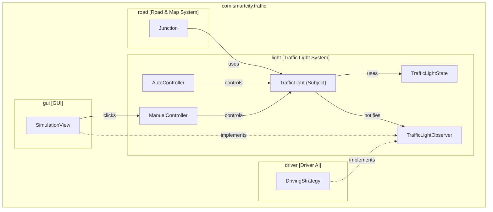
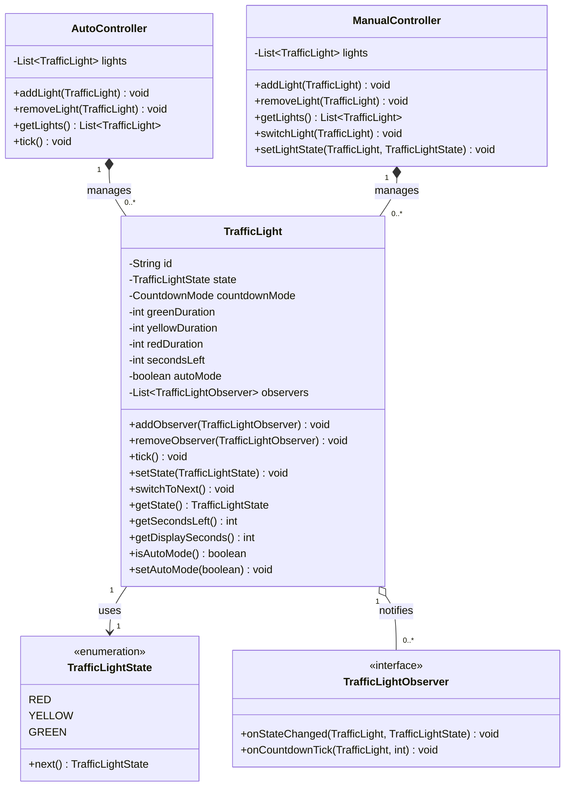

# 3. Traffic Light System

> **Dự án:** Smart City Traffic Simulation | **Module:** Phần 3 – Traffic Light System | **Thành viên:** [Tên bạn]

---

## Mục lục

1. [Bảng thống kê dữ liệu](#1-bảng-thống-kê-dữ-liệu)
2. [Biểu đồ phụ thuộc gói (Package Diagram)](#2-biểu-đồ-phụ-thuộc-gói)
3. [Biểu đồ lớp (Class Diagram)](#3-biểu-đồ-lớp)
4. [Giải thích thiết kế](#4-giải-thích-thiết-kế)
5. [Kỹ thuật OOP đã áp dụng](#5-kỹ-thuật-oop-đã-áp-dụng)
6. [Công nghệ sử dụng và thuật toán](#6-công-nghệ-sử-dụng-và-thuật-toán)
7. [Hướng dẫn sử dụng](#7-hướng-dẫn-sử-dụng)

---

## 1. Bảng thống kê dữ liệu

### 1.1 Thống kê cấu trúc module

| Thành phần | Số lượng | Mô tả |
|---|---|---|
| Lớp (Class) | 3 | TrafficLight, AutoController, ManualController |
| Enum | 1 | TrafficLightState (3 giá trị) |
| Interface | 1 | TrafficLightObserver |
| Package | 1 | `com.smartcity.traffic.light` |
| Phương thức (Method) | 30+ | Tổng số phương thức công khai trên tất cả các lớp |
| Thuộc tính (Field) | 15+ | Tổng số thuộc tính trên tất cả các lớp |
| Dòng code (LOC) | ~300 | Tổng số dòng code Java |

### 1.2 Thống kê các lớp

| Lớp | Thuộc tính | Phương thức | Vai trò | Pattern áp dụng |
|---|---|---|---|---|
| **TrafficLight** | 7 | 18 | Quản lý trạng thái và thời gian của một đèn giao thông | Observer (Subject) |
| **AutoController** | 1 | 4 | Điều khiển đèn tự động theo thời gian | Encapsulation |
| **ManualController** | 1 | 5 | Điều khiển đèn theo thao tác người dùng | Encapsulation |
| **TrafficLightObserver** | — | 2 | Interface nhận thông báo từ TrafficLight | Observer (Observer) |
| **TrafficLightState** | — | 1 | Enum trạng thái màu đèn | Enum |

### 1.3 Thống kê trạng thái đèn (TrafficLightState)

| Trạng thái | Enum | Ý nghĩa | Chuyển tiếp tiếp theo |
|---|---|---|---|
| Xanh | `GREEN` | Cho phép phương tiện di chuyển | → YELLOW |
| Vàng | `YELLOW` | Cảnh báo chuẩn bị dừng | → RED |
| Đỏ | `RED` | Yêu cầu phương tiện dừng lại | → GREEN |

### 1.4 Thống kê kiểu đếm giây (CountdownMode)

| Kiểu đếm | Enum | Mô tả | Ví dụ thực tế |
|---|---|---|---|
| Không đếm | `NONE` | Không hiển thị số giây | Đèn giao thông cũ ở khu phố cổ |
| Đếm toàn bộ | `FULL` | Hiển thị số giây cho mọi trạng thái | Đèn hiện đại tại ngã tư lớn |
| Chỉ đếm 10s cuối | `LAST_TEN` | Chỉ hiện số khi còn ≤ 10 giây | Đèn tại một số nút giao thường gặp |

### 1.5 Thống kê chế độ điều khiển

| Chế độ | Lớp | autoMode | Cách hoạt động |
|---|---|---|---|
| Tự động | `AutoController` | true | Mỗi `tick()` giảm thời gian, tự chuyển trạng thái khi hết giờ |
| Thủ công | `ManualController` | false | Đèn chỉ đổi khi `switchLight()` hoặc `setLightState()` được gọi (người dùng click) |

---

## 2. Biểu đồ phụ thuộc gói

Biểu đồ dưới đây thể hiện mối quan hệ phụ thuộc giữa package **light** (Traffic Light System) và các package khác trong hệ thống. Package **light** cung cấp trạng thái đèn cho **road** (Junction) và **driver** (xe quan sát đèn để dừng/đi), đồng thời được **gui** sử dụng để hiển thị và điều khiển.



---

## 3. Biểu đồ lớp

Biểu đồ lớp thể hiện chi tiết cấu trúc nội bộ của 5 thành phần trong Traffic Light System, bao gồm thuộc tính, phương thức và mối quan hệ. Ký hiệu **♦** (composition) thể hiện quan hệ "chứa đựng", ký hiệu **→** thể hiện quan hệ "sử dụng", ký hiệu **..|>** thể hiện quan hệ "implements".



---

## 4. Giải thích thiết kế

### 4.1 Package

**Package:** `com.smartcity.traffic.light`

Tên package tuân theo quy ước đặt tên Java (reverse domain name). Toàn bộ 5 thành phần của Traffic Light System được đặt trong cùng một package để thể hiện sự gắn kết về mặt chức năng.

| Package phụ thuộc | Lý do |
|---|---|
| `java.util` | Sử dụng ArrayList, List, Collections |
| (không phụ thuộc các package khác) | Module được thiết kế độc lập, các module khác (Vehicle, Driver AI, GUI) phụ thuộc vào module này, không phải ngược lại |

### 4.2 Các thành phần

#### TrafficLightState — Trạng thái đèn

`TrafficLightState` là enum đại diện cho 3 màu đèn: `RED`, `YELLOW`, `GREEN`. Phương thức `next()` định nghĩa chu trình chuyển đổi cố định: GREEN → YELLOW → RED → GREEN, giúp logic chuyển trạng thái nằm tập trung tại một nơi duy nhất.

> **Ví dụ thực tế:** Đèn đang xanh, sau khi hết giờ xanh sẽ tự chuyển sang vàng, rồi đỏ, rồi lại xanh — đúng như chu trình đèn giao thông thực tế ngoài đường.

#### TrafficLightObserver — Giao diện quan sát

`TrafficLightObserver` là interface theo mẫu Observer pattern, định nghĩa 2 phương thức callback: `onStateChanged()` (gọi khi đèn đổi màu) và `onCountdownTick()` (gọi khi bộ đếm giây thay đổi). Bất kỳ module nào cần biết trạng thái đèn (xe, GUI...) chỉ cần implement interface này và đăng ký với `TrafficLight`.

> **Ví dụ thực tế:** Giống như việc đăng ký nhận thông báo (subscribe) từ một kênh tin tức — mỗi khi có tin mới (đèn đổi màu), tất cả người đăng ký đều được báo ngay, mà kênh tin tức (TrafficLight) không cần biết ai đang theo dõi.

#### TrafficLight — Đèn giao thông (Subject)

`TrafficLight` là lớp trung tâm của module, đóng vai trò Subject trong Observer pattern. Mỗi đèn lưu trạng thái hiện tại (`state`), thời gian quy định cho từng màu (`greenDuration`, `yellowDuration`, `redDuration`), số giây còn lại (`secondsLeft`), và kiểu hiển thị đếm giây (`countdownMode`). Phương thức `tick()` mô phỏng 1 đơn vị thời gian trôi qua: nếu đang ở chế độ tự động (`autoMode = true`) và hết giờ, đèn tự chuyển sang trạng thái kế tiếp và thông báo cho tất cả observer.

> **Ví dụ thực tế:** Đèn tại ngã tư Lê Văn Lương – Hoàng Quốc Việt được cấu hình xanh 20s, vàng 3s, đỏ 25s, kiểu đếm `FULL`. Mỗi giây trôi qua, đèn tự giảm bộ đếm và phát tín hiệu cho các xe đang chờ biết còn bao nhiêu giây.

#### AutoController — Điều khiển tự động

`AutoController` quản lý một danh sách các `TrafficLight` và đảm bảo mọi đèn được thêm vào đều ở `autoMode = true`. Khi `tick()` được gọi (mỗi vòng lặp mô phỏng), tất cả đèn trong danh sách sẽ tự `tick()`, tự giảm thời gian và tự chuyển màu khi cần — không cần can thiệp từ người dùng.

> **Ví dụ thực tế:** Vào giờ hành chính, đèn giao thông tại các ngã tư lớn hoạt động hoàn toàn tự động theo chu trình đã lập trình sẵn, không cần cảnh sát giao thông đứng điều khiển.

#### ManualController — Điều khiển thủ công

`ManualController` quản lý danh sách `TrafficLight` ở `autoMode = false` — đèn không tự đổi theo thời gian. Khi người dùng click vào đèn trên GUI, GUI gọi `switchLight(light)` để chuyển sang trạng thái kế tiếp, hoặc `setLightState(light, state)` để đặt trực tiếp một màu cụ thể.

> **Ví dụ thực tế:** Khi có sự cố hoặc giờ cao điểm bất thường, cảnh sát giao thông đứng tại ngã tư và bật/tắt đèn bằng tay thay vì để đèn chạy tự động.

---

## 5. Kỹ thuật OOP đã áp dụng

| Kỹ thuật | Áp dụng ở đâu | Lợi ích cụ thể |
|---|---|---|
| **Encapsulation** | Tất cả các lớp: thuộc tính `private`, truy cập qua getter/setter | Bảo vệ trạng thái đèn, tránh bị thay đổi trực tiếp gây sai logic mô phỏng |
| **Observer Pattern** | `TrafficLight` (Subject) và `TrafficLightObserver` (Observer) | Các module khác (Vehicle, GUI) nhận thông báo đổi đèn mà không cần `TrafficLight` biết chi tiết về chúng — giảm phụ thuộc chặt (loose coupling) |
| **Enum** | `TrafficLightState` (3 giá trị), `CountdownMode` (3 giá trị) | Tránh lỗi chính tả, compiler kiểm tra giá trị hợp lệ, code dễ đọc |
| **Single Responsibility** | Mỗi lớp chỉ làm một việc: TrafficLight quản lý trạng thái, AutoController/ManualController chỉ điều khiển | Dễ kiểm thử, dễ bảo trì, dễ thay thế từng phần |
| **Open/Closed Principle** | Thêm chế độ điều khiển mới (vd: SensorController) chỉ cần tạo lớp mới dùng `TrafficLight`, không sửa lớp `TrafficLight` | Mở rộng dễ dàng, không phá vỡ code hiện tại |

### 5.1 Encapsulation — Chi tiết

Mọi thuộc tính trong `TrafficLight` đều được khai báo `private`. Trạng thái và thời gian chỉ có thể thay đổi qua các phương thức công khai như `setState()`, `tick()`, `setAutoMode()`, đảm bảo mỗi lần thay đổi đều đi kèm việc cập nhật bộ đếm giây và thông báo observer một cách đồng bộ.

```java
// Không thể làm điều này (compile error):
light.state = TrafficLightState.GREEN;

// Phải đi qua phương thức công khai — đảm bảo đồng bộ trạng thái & thông báo:
light.setState(TrafficLightState.GREEN);
```

> **Ví dụ thực tế:** Bạn không thể tự ý leo lên cột đèn và bẻ đèn sang màu xanh. Mọi thay đổi trạng thái đèn phải đi qua hệ thống điều khiển trung tâm (giống như đi qua setter), đảm bảo đồng bộ với bộ đếm thời gian.

### 5.2 Observer Pattern — Chi tiết

`TrafficLight` giữ một danh sách `observers`. Mỗi khi trạng thái đổi hoặc bộ đếm giây thay đổi, `TrafficLight` lặp qua danh sách và gọi `onStateChanged()` / `onCountdownTick()` trên từng observer, mà không cần biết observer đó là một chiếc xe, một module GUI, hay bất kỳ đối tượng nào khác.

```java
public void addObserver(TrafficLightObserver observer) {
    if (observer != null && !observers.contains(observer)) {
        observers.add(observer);
    }
}

private void notifyStateChanged() {
    for (TrafficLightObserver obs : observers) {
        obs.onStateChanged(this, state);
    }
}
```

> **Ví dụ thực tế:** Giống như chuông báo hết giờ ở một cuộc thi — mọi thí sinh (observer) đều nghe thấy chuông (sự kiện đổi đèn) cùng lúc và tự phản ứng theo cách riêng của mình (dừng xe, vẽ lại đèn trên màn hình...), người gõ chuông (TrafficLight) không cần biết ai đang nghe.

### 5.3 Enum — Chi tiết

Thay vì dùng số nguyên hoặc chuỗi ký tự để biểu diễn màu đèn (dễ gõ sai, dễ so sánh nhầm), hệ thống dùng enum `TrafficLightState`. Phương thức `next()` được định nghĩa ngay trong enum, gói toàn bộ logic chuyển trạng thái vào một nơi duy nhất.

```java
// Sai — không rõ ràng, dễ nhầm:
if (lightColor.equals("green")) { ... }

// Đúng — rõ ràng, compiler kiểm tra:
if (light.getState() == TrafficLightState.GREEN) { ... }

// Logic chuyển trạng thái nằm gọn trong enum:
TrafficLightState nextState = currentState.next();
```

---

## 6. Công nghệ sử dụng và thuật toán

### 6.1 Công nghệ sử dụng

| Công nghệ | Phiên bản | Mục đích sử dụng |
|---|---|---|
| Java | JavaSE-1.8 | Ngôn ngữ lập trình chính, hỗ trợ OOP đầy đủ |
| ArrayList | java.util | Lưu danh sách observer (trong TrafficLight) và danh sách đèn (trong AutoController/ManualController) |
| List, Collections | java.util | Trả về danh sách đèn không thể chỉnh sửa từ bên ngoài (`unmodifiableList`) |
| Enum | java.lang | Biểu diễn trạng thái đèn (`TrafficLightState`) và kiểu đếm giây (`CountdownMode`) |

### 6.2 Thuật toán

**Thuật toán 1: Chu trình chuyển đổi trạng thái đèn**

Định nghĩa trong `TrafficLightState.next()`, đảm bảo đèn luôn chuyển đúng thứ tự GREEN → YELLOW → RED → GREEN, không phụ thuộc nơi gọi.

```
GREEN → YELLOW → RED → GREEN → ...
```

```java
public TrafficLightState next() {
    switch (this) {
        case GREEN:  return YELLOW;
        case YELLOW: return RED;
        case RED:    return GREEN;
        default:     return RED;
    }
}
```

**Thuật toán 2: Đếm ngược thời gian theo tick**

Mỗi lần `tick()` được gọi (1 đơn vị thời gian, ví dụ 1 giây), `secondsLeft` giảm đi 1. Khi `secondsLeft` về 0, đèn tự động chuyển sang trạng thái kế tiếp và reset bộ đếm theo thời gian cấu hình của trạng thái mới.

```
Nếu secondsLeft <= 0 → chuyển trạng thái kế tiếp, reset secondsLeft
Ngược lại → secondsLeft--, thông báo observer
```

```java
public void tick() {
    if (!autoMode) return;
    secondsLeft--;
    if (secondsLeft <= 0) {
        setState(state.next());
    } else {
        notifyCountdownTick();
    }
}
```

**Thuật toán 3: Hiển thị số giây theo CountdownMode**

`getDisplaySeconds()` quyết định GUI có nên hiển thị số giây hay không, dựa trên kiểu đếm của đèn.

```
NONE      → luôn trả về -1 (không hiển thị)
FULL      → trả về secondsLeft (luôn hiển thị)
LAST_TEN  → trả về secondsLeft nếu <= 10, ngược lại trả về -1
```

```java
public int getDisplaySeconds() {
    switch (countdownMode) {
        case NONE:     return -1;
        case LAST_TEN: return secondsLeft <= 10 ? secondsLeft : -1;
        case FULL:
        default:       return secondsLeft;
    }
}
```

---

## 7. Hướng dẫn sử dụng

### 7.1 Biên dịch và chạy

```bash
# Bước 1: Biên dịch
cd smartcity
mkdir -p bin
javac -d bin src/com/smartcity/traffic/light/*.java

# Bước 2: Chạy demo (nếu có lớp main riêng để test)
java -cp bin com.smartcity.traffic.light.TrafficLightDemo
```

### 7.2 Ví dụ sử dụng cơ bản

```java
// 1. Tạo một đèn giao thông tại ngã tư, kiểu đếm giây FULL
TrafficLight light = new TrafficLight(
    "J1-North", 20, 3, 25, TrafficLight.CountdownMode.FULL, TrafficLightState.GREEN);

// 2. Đăng ký observer (vd: GUI hoặc xe muốn theo dõi đèn)
light.addObserver(new TrafficLightObserver() {
    @Override
    public void onStateChanged(TrafficLight light, TrafficLightState newState) {
        System.out.println("Đèn " + light.getId() + " đổi sang " + newState);
    }

    @Override
    public void onCountdownTick(TrafficLight light, int secondsLeft) {
        int display = light.getDisplaySeconds();
        if (display >= 0) {
            System.out.println("Còn " + display + "s");
        }
    }
});

// 3. Chế độ tự động: dùng AutoController
AutoController auto = new AutoController();
auto.addLight(light);

// Vòng lặp mô phỏng (mỗi tick = 1 giây)
while (running) {
    auto.tick();
}

// 4. Chế độ thủ công: dùng ManualController
ManualController manual = new ManualController();
manual.addLight(light);

// Khi người dùng click vào đèn trên GUI:
manual.switchLight(light);
```

### 7.3 Tích hợp với các module khác

| Module | Cách tích hợp |
|---|---|
| **Road & Map System** | `Junction` lưu tham chiếu đến `TrafficLight` để biết trạng thái đèn tại ngã rẽ đó |
| **Vehicle / Driver AI** | Implement `TrafficLightObserver`, gọi `light.addObserver(this)` để biết khi nào cần dừng (RED) hoặc được đi (GREEN) |
| **GUI** | Implement `TrafficLightObserver` để vẽ lại màu đèn và số giây (`getDisplaySeconds()`); gọi `manualController.switchLight(light)` khi người dùng click vào đèn |
| **Simulation Loop** | Gọi `autoController.tick()` mỗi vòng lặp (đại diện cho 1 giây trôi qua) để các đèn tự động chuyển màu |

### 7.4 Kết quả chạy demo

```
=== Demo AutoController (đèn đếm số giây kiểu FULL) ===
[North] GREEN còn 4s
[North] GREEN còn 3s
[North] GREEN còn 2s
[North] GREEN còn 1s
[North] -> YELLOW
[North] YELLOW còn 1s
[North] -> RED
[North] RED còn 3s
[North] RED còn 2s
[North] RED còn 1s
[North] -> GREEN
[North] GREEN còn 4s

=== Demo ManualController (người dùng click đổi đèn) ===
[West] -> GREEN
[West] -> YELLOW
[West] -> RED
Trạng thái cuối của West (sau tick, không đổi): RED
```

---

*Traffic Light System — Smart City Traffic Simulation | Thành viên: [Tên bạn]*
